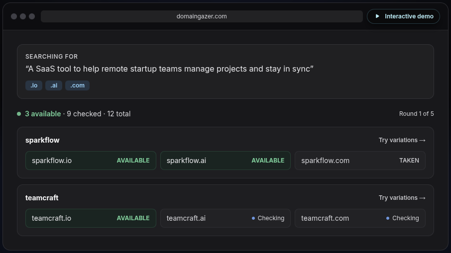

# DomainGazer

[](https://github.com/radoslavdodek/domaingazer/actions/workflows/ci.yml)

An AI-powered domain name finder. Describe your project, select your preferred TLDs, and get brandable domain name candidates with real-time availability checking.

Try it out at [https://domaingazer.com](https://domaingazer.com).

## How it works

1. Enter a description of your project and select TLDs
2. The configured AI provider/model generates 10 base name candidates per round (up to 6 rounds)
3. Each `(baseName, tld)` pair is checked against AWS Route 53 Domains in real time
4. Results stream back via SSE, updating live from `CHECKING` to a final availability status
5. Generation stops early once an available domain is found

## Getting started

### Prerequisites

- Node.js 18+
- OpenAI API key or Groq API key (based on your provider config)
- AWS credentials with Route 53 Domains access (must use `us-east-1`)
- Supabase project (Auth enabled)
- Stripe account with Billing enabled

### Setup

```bash
cp .env.example .env.local
# Fill in your credentials (see Environment variables below)
npm install
# Apply Supabase migrations before first run
npm run dev
```

Open [http://localhost:3000](http://localhost:3000).

## Environment variables

```
OPENAI_API_KEY=
GROQ_API_KEY=
AWS_ACCESS_KEY_ID=
AWS_SECRET_ACCESS_KEY=
AWS_REGION=us-east-1
NEXT_PUBLIC_SUPABASE_URL=
NEXT_PUBLIC_SUPABASE_ANON_KEY=
SUPABASE_SERVICE_ROLE_KEY=
STRIPE_SECRET_KEY=
STRIPE_WEBHOOK_SECRET=
STRIPE_PRICE_MONTHLY_EUR_ID=
STRIPE_PRICE_YEARLY_EUR_ID=
STRIPE_PRICE_MONTHLY_USD_ID=
STRIPE_PRICE_YEARLY_USD_ID=
FREE_CREDIT_IDENTITY_SALT=
FREE_CREDITS_TOTAL=
FREE_CREDITS_COST_SEARCH=
FREE_CREDITS_COST_EXPLAIN=
NEXT_PUBLIC_SITE_URL=
GDPR_COUNTRY_HEADER_NAME=x-country-code
GDPR_DEFAULT_REGION=eu
NEXT_PUBLIC_NAMECHEAP_AFFILIATE_ID=
NEXT_PUBLIC_CLARITY_PROJECT_ID=
NEXT_PUBLIC_GA_MEASUREMENT_ID=
```

Notes:

- `SUPABASE_SERVICE_ROLE_KEY` is required for server-side billing sync and Stripe webhook writes.
- `STRIPE_SECRET_KEY` must be a secret key (`sk_test_...` locally, `sk_live_...` in production).
- `STRIPE_WEBHOOK_SECRET` is the signing secret for the Stripe endpoint that points to `/api/stripe/webhook`.
- `STRIPE_PRICE_MONTHLY_EUR_ID`, `STRIPE_PRICE_YEARLY_EUR_ID`, `STRIPE_PRICE_MONTHLY_USD_ID`, and `STRIPE_PRICE_YEARLY_USD_ID` must be recurring Stripe Price IDs, not Product IDs. EUR prices are shown to EU visitors, USD prices to everyone else.
- `FREE_CREDIT_IDENTITY_SALT` is a server-only secret used to hash account identifiers for durable free-credit enforcement after account deletion.
- `FREE_CREDITS_TOTAL` is a one-time lifetime allowance. It does not reset.
- `FREE_CREDITS_COST_SEARCH` and `FREE_CREDITS_COST_EXPLAIN` define how many credits each successful action consumes.
- `GDPR_COUNTRY_HEADER_NAME` lets you trust a reverse-proxy header for country detection (useful on VPS deployments behind Nginx).
- `GDPR_DEFAULT_REGION` controls the fallback when no country signal exists. The safest default is `eu`.
- `NEXT_PUBLIC_NAMECHEAP_AFFILIATE_ID` is the Impact affiliate ID for Namecheap. When set, available domains show a "Buy" button linking to Namecheap via affiliate tracking. Without it, the link goes directly to Namecheap without tracking.
- `NEXT_PUBLIC_CLARITY_PROJECT_ID` enables Microsoft Clarity session recording and heatmaps after optional-services consent allows it.
- `NEXT_PUBLIC_GA_MEASUREMENT_ID` enables Google Analytics measurement after optional-services consent allows it.

## Supabase setup

The app now depends on Supabase Auth plus the billing tables in `supabase/migrations/`.

### Required auth configuration

- Enable **Google** sign-in in Supabase Auth → Providers (requires Google OAuth client ID/secret).
  - In Google Cloud Console, add every local dev origin you actually use to the OAuth web client’s **Authorized JavaScript origins**.
  - For local development that usually means `http://localhost:3000`, and also `http://localhost:3001` if port 3000 is occupied and Next starts on 3001.
- Enable **GitHub** sign-in in Supabase Auth → Providers (requires a GitHub OAuth App client ID/secret — create one at https://github.com/settings/developers).
- **Email/OTP (magic link)** is enabled by default in Supabase — verify that email templates are configured in Auth → Email Templates.
- Set the site URL and redirect URLs so Supabase can return users to:
  - `http://localhost:3000/auth/callback` for local development
  - `http://localhost:3001/auth/callback` if your local app is running on port 3001
  - `https://your-domain.com/auth/callback` for production

### Apply database migrations

Run all migrations in the `supabase/migrations/` folder, including the billing migration:

- `20260228_search_history.sql`
- `20260301_model_usage.sql`
- `20260302_model_usage_cost.sql`
- `20260303_billing.sql`
- `20260304_free_credit_entitlements.sql`
- `20260305_free_credit_entitlements_rls.sql`

You can apply them with the Supabase CLI or by running the SQL in the Supabase SQL editor.

The billing migration creates:

- `billing_customers`
- `subscriptions`
- `credit_usage`
- `free_credit_entitlements`

Those tables are required for Stripe customer mapping, subscription status, per-account audit history, and durable
free-credit tracking that survives account deletion.

## Stripe billing setup

The app supports:

- one-time free credits for all users
- unlimited usage for paid subscribers
- monthly and yearly subscriptions with the same entitlements
- Stripe Checkout for subscription purchase
- Stripe Billing Portal for plan management and cancellation

### 1. Create a product in Stripe

In the Stripe Dashboard:

1. Open `Product catalog`.
2. Create one product for your paid plan, for example `Domain Gazer Pro`.
3. Create four recurring prices on that product:
   - one monthly recurring price in EUR
   - one yearly recurring price in EUR
   - one monthly recurring price in USD
   - one yearly recurring price in USD

Use one product with four prices. The app determines monthly vs yearly access from the selected recurring price, and EUR vs USD from the visitor's region.

### 2. Capture the recurring price IDs

After creating the prices, copy the four Stripe Price IDs (two per currency):

- EUR monthly price ID -> `STRIPE_PRICE_MONTHLY_EUR_ID`
- EUR yearly price ID -> `STRIPE_PRICE_YEARLY_EUR_ID`
- USD monthly price ID -> `STRIPE_PRICE_MONTHLY_USD_ID`
- USD yearly price ID -> `STRIPE_PRICE_YEARLY_USD_ID`

Do not use the product ID (`prod_...`). The app expects the recurring price IDs (`price_...`).

The app selects EUR or USD based on the visitor's `dg_region` cookie (set by middleware). EU visitors see EUR prices, everyone else sees USD.

### 3. Set Stripe keys in `.env.local`

Example:

```bash
STRIPE_SECRET_KEY=sk_test_...
STRIPE_PRICE_MONTHLY_EUR_ID=price_...
STRIPE_PRICE_YEARLY_EUR_ID=price_...
STRIPE_PRICE_MONTHLY_USD_ID=price_...
STRIPE_PRICE_YEARLY_USD_ID=price_...
```

For local development, use test-mode keys and test-mode prices. For production, use live-mode keys and live-mode prices.

Do not mix test and live resources in the same environment.

### 4. Configure the webhook endpoint

The app expects Stripe to send webhook events to:

```text
/api/stripe/webhook
```

Required events:

- `checkout.session.completed`
- `customer.subscription.created`
- `customer.subscription.updated`
- `customer.subscription.deleted`

These events keep the local Supabase billing state in sync with Stripe.

### 5. Local development with Stripe CLI

For local testing, forward Stripe events to your local app:

```bash
stripe listen --forward-to localhost:3000/api/stripe/webhook
```

The Stripe CLI prints a webhook signing secret. Put that value into:

```bash
STRIPE_WEBHOOK_SECRET=whsec_...
```

Keep the CLI running while testing checkout locally.

### 6. Production webhook setup

In production, create a webhook endpoint in Stripe that points to:

```text
https://your-domain.com/api/stripe/webhook
```

Then copy the production webhook signing secret into:

```bash
STRIPE_WEBHOOK_SECRET=whsec_...
```

Use a different signing secret for local and production environments.

### 7. How checkout works in this app

When a signed-in user starts a paid plan:

1. The app creates or reuses a Stripe Customer.
2. The app creates a Stripe Checkout Session in `subscription` mode.
3. Stripe redirects the user back to `/billing/success` or `/billing/cancel`.
4. The webhook updates Supabase tables.
5. The app reads subscription state from Supabase for billing enforcement.

Stripe is the source of truth. Supabase is a local mirror used by the app for fast entitlement checks.

### 8. How the billing portal works

The `Manage Billing` action creates a Stripe Billing Portal session for the current user.

Users can:

- update payment methods
- cancel at period end
- review their subscription

The portal returns users to the app root (`/`) after completion.

### 9. Free credit configuration

The free plan is controlled entirely by environment variables:

```bash
FREE_CREDIT_IDENTITY_SALT=replace-with-a-random-secret
FREE_CREDITS_TOTAL=100
FREE_CREDITS_COST_SEARCH=10
FREE_CREDITS_COST_EXPLAIN=1
```

Behavior:

- every user starts with `FREE_CREDITS_TOTAL`
- free credits are lifetime-only and never replenish
- a hashed anti-abuse marker is retained after account deletion so the same email/Google identity cannot reclaim fresh free credits
- a successful `search` consumes `FREE_CREDITS_COST_SEARCH`
- a successful `explain` consumes `FREE_CREDITS_COST_EXPLAIN`
- paid subscribers bypass the free-credit cap entirely

If you change these values, redeploy the app so the new limits take effect.

### 10. Billing verification checklist

Before considering billing fully configured, verify all of the following:

1. A signed-in free user sees the usage card in the dashboard.
2. Monthly checkout opens Stripe Checkout.
3. Yearly checkout opens Stripe Checkout with the yearly price.
4. Completing checkout creates/updates rows in:
   - `billing_customers`
   - `subscriptions`
5. The dashboard switches from `Free` to `Pro Monthly` or `Pro Yearly`.
6. `Manage Billing` opens the Stripe Billing Portal.
7. Canceling in the portal eventually updates the local `subscriptions.status` via webhook.

### 11. Common Stripe billing issues

- `Missing required environment variable: STRIPE_SECRET_KEY`
  - Your server env is missing the Stripe secret key.
- `Stripe webhook signature verification failed`
  - `STRIPE_WEBHOOK_SECRET` does not match the endpoint currently sending events.
- Checkout works but plan never updates in the app
  - The webhook is not configured, not reachable, or the required Stripe events are not enabled.
- Billing portal opens but subscription status is wrong
  - The local `subscriptions` row is stale because webhook delivery failed.
- User is charged but still blocked by free-credit limits
  - The checkout succeeded, but the webhook did not sync the subscription into Supabase.

## Admin: User impersonation

Admins can view the app as any non-admin user to debug issues, verify billing state, or reproduce problems.

### How to use

1. Sign in as an admin (`is_admin: true` in Supabase Auth `app_metadata`).
2. Go to `/admin/users`.
3. Search for a user by email or name.
4. Click **Impersonate** on the target row — you'll be redirected to `/` with an amber banner showing the impersonated user's email.
5. The app now behaves as that user: search history, billing status, usage stats, and all API calls resolve against the impersonated user's data.
6. Click **Stop Impersonating** in the banner to return to your own admin view.

### Restrictions

- Cannot impersonate yourself or another admin.
- Account deletion is blocked while impersonating.
- Non-admins with a manually set cookie are silently ignored (the cookie is only trusted after server-side admin validation).
- Admin routes (`/api/admin/*`) always use the real admin identity, never the impersonated user.

## AI provider config

Provider/model selection lives in [`src/config/ai-providers.json`](src/config/ai-providers.json):

```json
{
  "providers": [
    {
      "name": "OpenAI",
      "api-key": "OPENAI_API_KEY",
      "base-url": "https://api.openai.com/v1"
    },
    {
      "name": "Groq",
      "api-key": "GROQ_API_KEY",
      "base-url": "https://api.groq.com/openai/v1"
    }
  ],
  "generateDomains": {
    "provider": "Groq",
    "model": "moonshotai/kimi-k2-instruct-0905"
  },
  "explain": {
    "provider": "Groq",
    "model": "moonshotai/kimi-k2-instruct-0905"
  }
}
```

Set `generateDomains.provider` and `generateDomains.model` for search generation.
Set `explain.provider` and `explain.model` for the Explain button.

If you want both flows to use the same setup, keep both sections identical:

```json
{
  "generateDomains": {
    "provider": "Groq",
    "model": "moonshotai/kimi-k2-instruct-0905"
  },
  "explain": {
    "provider": "Groq",
    "model": "moonshotai/kimi-k2-instruct-0905"
  }
}
```

## Commands

```bash
npm run dev                      # Start dev server at localhost:3000
npm run generate:industry-pages  # Rebuild generated industry SEO pages
npm run build                    # Production build
npm run lint                     # ESLint via eslint CLI
```

## Industry SEO pages

The app includes a programmatic SEO cluster under `/domain-name-ideas` for pages such as:

- `/domain-name-ideas`
- `/domain-name-ideas/saas`
- `/domain-name-ideas/fintech`

The workflow is:

1. Edit the seed data in `src/data/industry-seeds.json`.
2. Run `npm run generate:industry-pages`.
3. Commit the updated generated artifact in `src/generated/industry-pages.ts`.

The generator script lives in `scripts/build-industry-pages.mjs`. It validates each generated page shape, rejects duplicate or overly similar content, and emits the static data consumed by the app route layer.

To add a new industry page:

1. Add a new seed object with a unique `slug`.
2. Fill in the audience, offer, tone, term sets, recommended TLDs, and avoid-patterns.
3. Run `npm run generate:industry-pages`.
4. Open `/domain-name-ideas/<slug>` locally to review the page.

The generated routes are wired automatically into the hub page, middleware allowlist, static params, and sitemap.

## Tech stack

- **Next.js 14** (App Router, Node.js runtime)
- **OpenAI-compatible AI clients** — OpenAI or Groq via config
- **AWS Route 53 Domains** — availability checking with exponential backoff
- **SSE** — real-time result streaming

## Deployment

The app runs on a Ubuntu VPS behind nginx. `deploy.sh` handles the full deploy over SSH.

### One-time server setup

```bash
# Install Node.js 20
curl -fsSL https://deb.nodesource.com/setup_20.x | sudo -E bash -
sudo apt install -y nodejs

# Install PM2
sudo npm install -g pm2

# Clone the repo
git clone <repo-url> /var/www/domaingazer
cd /var/www/domaingazer
cp .env.example .env.local
# edit .env.local and fill in real values

# Allow the deploy user to reload nginx without a password prompt
echo "deploy ALL=(ALL) NOPASSWD: /usr/bin/systemctl reload nginx, /usr/sbin/nginx" \
  | sudo tee /etc/sudoers.d/deploy
```

### Configure deploy.sh

Edit the variables at the top of `deploy.sh`:

| Variable | Default                | Description |
|---|------------------------|---|
| `SSH_USER` | `deploy`               | SSH user on the server |
| `SSH_HOST` | _(required)_           | VPS IP or hostname |
| `SSH_PORT` | `22`                   | SSH port |
| `SSH_KEY` | _(empty)_              | Path to private key, e.g. `~/.ssh/id_ed25519` |
| `APP_DIR` | `/var/www/domaingazer` | App directory on the server |
| `PM2_APP_NAME` | `domaingazer`          | PM2 process name |
| `BRANCH` | `main`                 | Git branch to deploy |

### Deploy

```bash
./deploy.sh
```

The script:
1. Verifies SSH connectivity
2. `git pull` the configured branch on the server
3. Runs `npm ci` to install dependencies
4. Runs `npm run build`
5. Reloads the PM2 process (starts it on first deploy)
6. Validates nginx config and runs `systemctl reload nginx`

### nginx config

```nginx
server {
    listen 80;
    server_name yourdomain.com;

    location / {
        proxy_pass http://127.0.0.1:3000;
        proxy_http_version 1.1;
        proxy_set_header Upgrade $http_upgrade;
        proxy_set_header Connection 'upgrade';
        proxy_set_header Host $host;
        proxy_set_header X-Real-IP $remote_addr;
        proxy_cache_bypass $http_upgrade;

        # Required for SSE streaming to work correctly
        proxy_buffering off;
        proxy_read_timeout 120s;
    }
}
```
